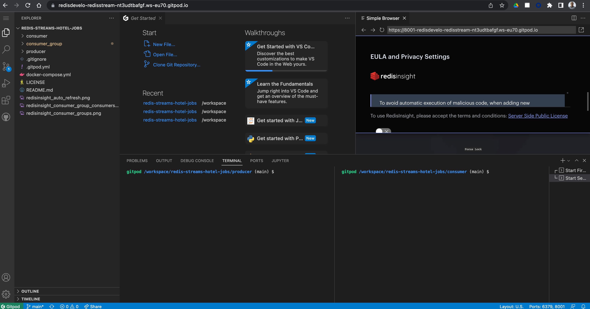
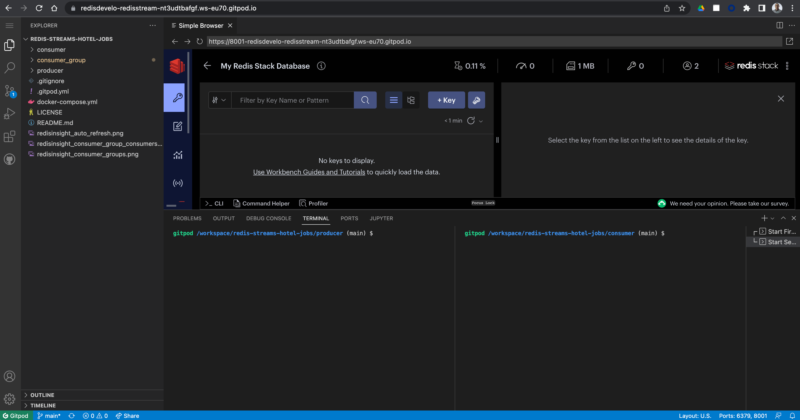
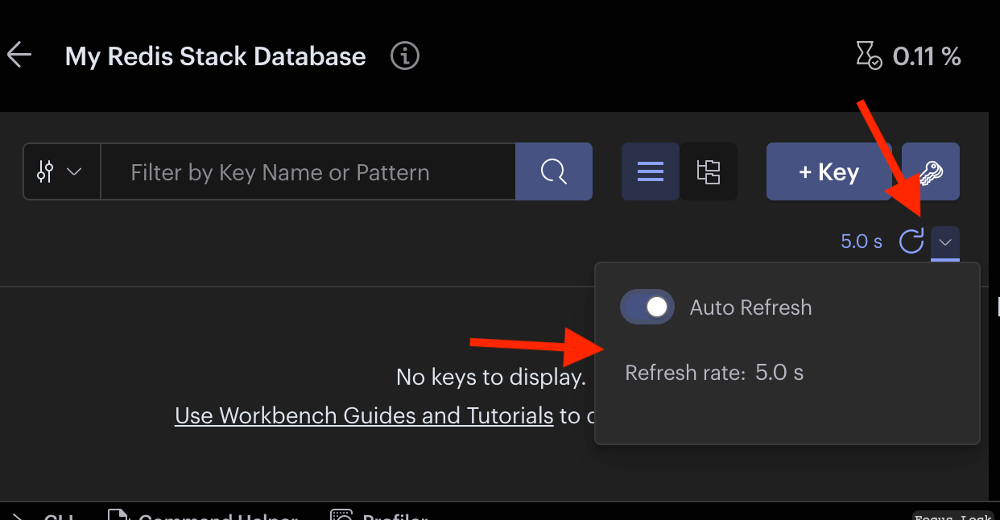
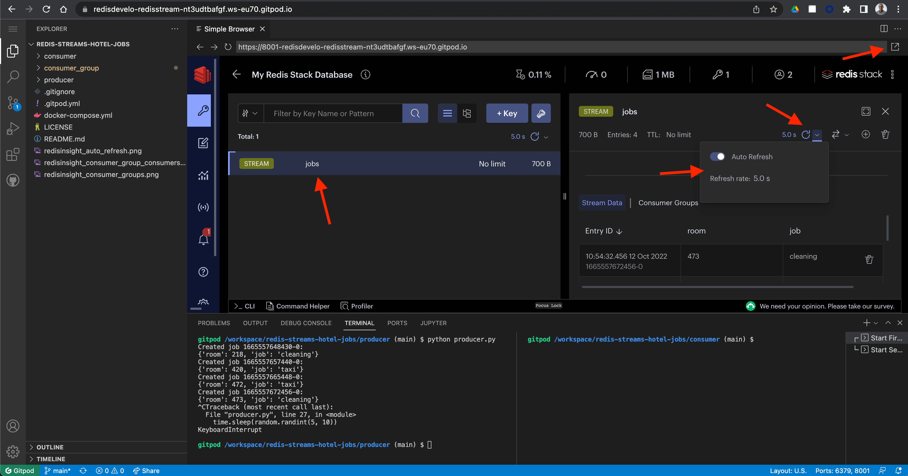
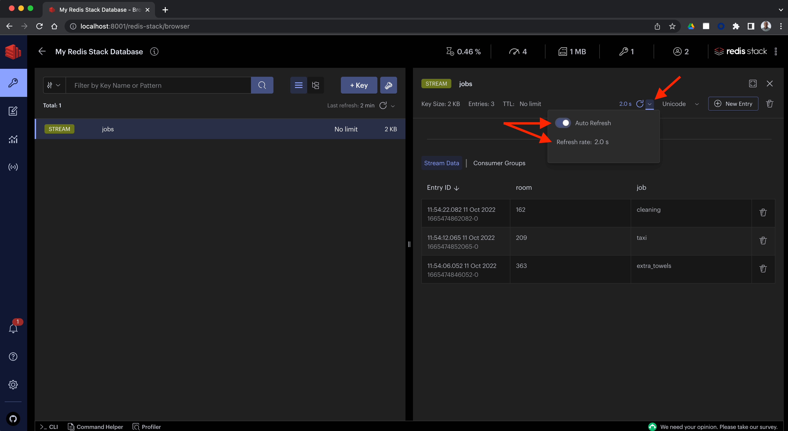
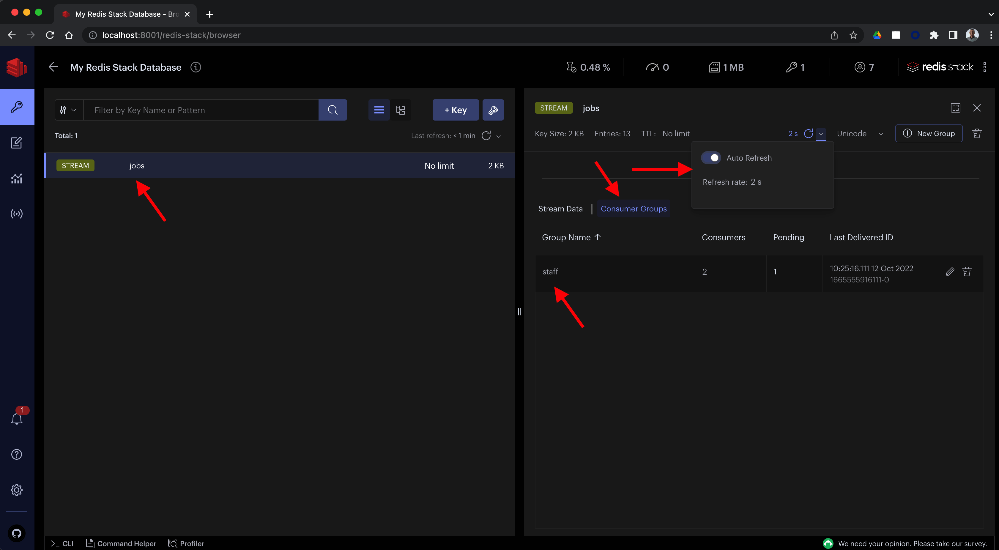
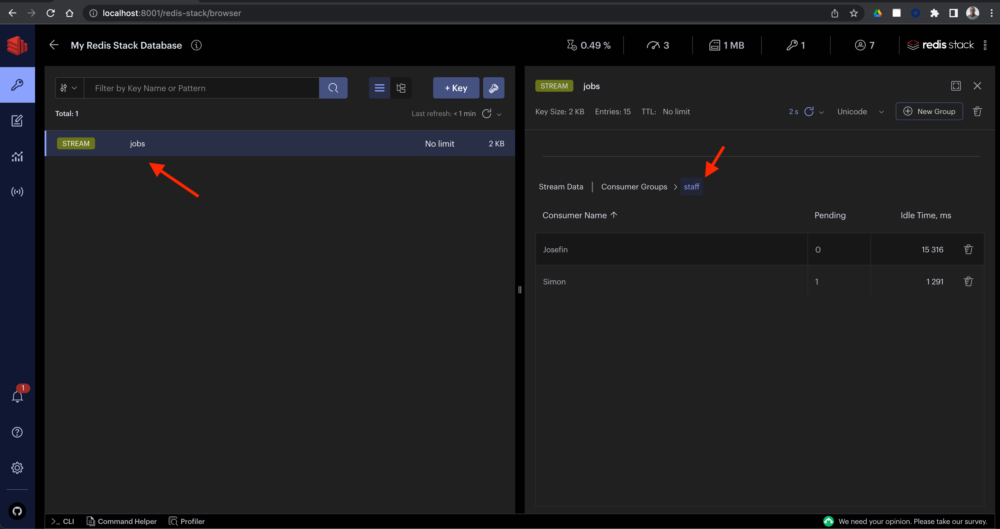

# Redis Streams Hotel Jobs Example with Node.js and Python

## Overview

This repository contains the code and Docker Compose file for my Redis Streams workshop.  To see a video presentation of this workshop, get the slides and other resources, [click here](https://simonprickett.dev/redis-streams-workshop/).

There are two ways to try out the code.  If you want to run everything in the cloud and don't want to install anything on your machine, use option 1 (GitPod hosted environment).  If you're comfortable using Docker and have appropriate versions of Python 3 and Node.js installed on your machine you could use option 2 (Run Locally).

In this workshop, we look at using a Redis Stream to manage requests from coming in from guests staying in rooms at a hotel.

## Option 1: Run on GitPod in the Cloud

To use this option, you'll need the following software installed:

* A modern web browser (Google Chrome, Mozilla Firefox, Apple Safari).  I've tested this workshop using Google Chrome for macOS on macOS Monterey.

You'll also need a GitHub account to sign into GitPod with.

### Start a GitPod Environment

GitPod provides hosted development environments in the cloud.  To start an environment with the code for this workshop plus a Redis instance and the RedisInsight tool, simply click here:

[](https://gitpod.io/#https://github.com/redis-developer/redis-streams-hotel-jobs)

You will need to authorize GitPod to work with your GitHub account.  

Allow the GitPod environment a few moments to configure itself, start Redis and install the project dependencies.  These tasks are performed automatically for you.

When it's ready, your environment will look like this:



Close the VSCode welcome tab(s), and accept the terms and conditions for RedisInsight.  Your workspace should now look like this:



Turn on the Auto Refresh control in RedisInsight:



You're now ready to start running code!

### Running the Producer Component

Start the Producer component by typing the following command into the LEFT SIDE terminal window:

```
python producer.py
```

You should see the Producer creating new jobs every few seconds:

```
Created job 1665557648430-0:
{'room': 218, 'job': 'cleaning'}
Created job 1665557657440-0:
{'room': 420, 'job': 'taxi'}
```

You can stop the Producer at any point using Ctrl+C.  Leave it running for now.

### Watching the Stream with RedisInsight

Notice that a key named "jobs" appeared in RedisInsight, and that it is of type "STREAM".  Click on this key name to view the contents of the stream.  Turn on the auto refresh control for the contents to see them update as the Producer adds new jobs to the stream:



You may want to click the arrow icon in the top right corner to open RedisInsight in its own browser tab to give it more room.

### Running the Consumer Component

Start the Consumer component by entering the following command into the RIGHT SIDE terminal window:

```
python consumer.py
```

You should see the Consumer reading jobs from the stream and printing the details of each one:

```
Checking for jobs...
[['jobs', [('1665557648430-0', {'room': '218', 'job': 'cleaning'})]]]
['jobs', [('1665557648430-0', {'room': '218', 'job': 'cleaning'})]]
Performing job 1665557648430-0: {'room': '218', 'job': 'cleaning'}
Checking for jobs...
[['jobs', [('1665557657440-0', {'room': '420', 'job': 'taxi'})]]]
['jobs', [('1665557657440-0', {'room': '420', 'job': 'taxi'})]]
Performing job 1665557657440-0: {'room': '420', 'job': 'taxi'}
```

When you are done looking at this, stop the Consumer using Ctrl+C.

### Running the Consumer Group Components

TODO

### Watching the Consumer Group Status with RedisInsight

TODO

## Option 2: Run Locally

To use this option, you'll need the following software installed:

* Docker Desktop (for the `docker-compose` command).
* Git (to clone the repository from GitHub).
* Python 3 (to run the Producer component).  I've tested this on Python 3.9, but it should work with Python 3.8 or higher.
* Node.js (to run the Consumer component).  I've tested this with Node.js version 16, but it should work with Node.js version 14.8 or higher.
* A modern web browser (Google Chrome, Mozilla Firefox, Apple Safari).  I've tested this workshop using Google Chrome for macOS on macOS Monterey.

### Clone this Repository from GitHub

Clone this repository to your local machine then use the `cd` command to enter the folder that's created for you:

```
git clone https://github.com/redis-developer/redis-streams-hotel-jobs.git
cd redis-streams-hotel-jobs
```

### Starting Redis and RedisInsight

Before starting Redis, make sure that you don't have anything running on ports 6379 or 8001.  Use Docker Compose to start Redis and RedisInsight:

```
docker-compose up -d
```

Using your browser, navigate to `http://localhost:8001` - you should see RedisInsight.  Accept the terms and conditions, then RedisInsight should connect to your new Redis instance that is running on port 6379.

When you've finished working with the code, stop Redis and RedisInsight like this:

```
docker-compose down
```

### Running the Producer Component

The Producer is written in Python, using the [redis-py](https://github.com/Redis/redis-py) Redis client.

#### Setup

Before running the Producer, create and activate a virtual environment then install the requirements:

```
cd producer
python3 -m venv venv
. ./venv/bin/activate
pip install -r requirements.txt
```

#### Start the Producer

Now, start the Producer like this:

```
python producer.py
```

Every few seconds, it should create a new job, print out the job details and add it to the Redis Stream:

```
Created job 1665474073919-0:
{'room': 341, 'job': 'taxi'}
Created job 1665474082937-0:
{'room': 281, 'job': 'extra_pillows'}
```

To stop the Producer, press Ctrl+C.

### Watching the Stream with RedisInsight

Using your browser, navigate to `http://localhost:8001`.  Accept the terms and conditions to use RedisInsight.

You should now see the RedisInsight key browser view, showing one key whose type is `STREAM` and whose name is `jobs`.  Click on the text `jobs` to open up the key viewer for this Stream.

To the right, you should now see a panel showing the contents of the Stream.  Turn on the auto refresh option for this panel, and set the refresh rate to 2 seconds as shown:



You should now see the Stream entries that the Producer component is creating as they're added to the Stream.

### Running the Consumer Component

The Consumer is also written in Python, using the [redis-py](https://github.com/Redis/redis-py) Redis client. 

#### Setup

Before running the Consumer, create and activate a virtual environment then install the requirements:

```
cd consumer
python3 -m venv venv
. ./venv/bin/activate
pip install -r requirements.txt
```

#### Start the Consumer

Now, start the Consumer like this:

```
python consumer.py
```

You should see the Consumer read jobs from the Redis Stream and print out their details:

```
Checking for jobs...
[['jobs', [('1665474846052-0', {'room': '363', 'job': 'extra_towels'})]]]
['jobs', [('1665474846052-0', {'room': '363', 'job': 'extra_towels'})]]
Performing job 1665474846052-0: {'room': '363', 'job': 'extra_towels'}
Checking for jobs...
[['jobs', [('1665474852065-0', {'room': '209', 'job': 'taxi'})]]]
['jobs', [('1665474852065-0', {'room': '209', 'job': 'taxi'})]]
Performing job 1665474852065-0: {'room': '209', 'job': 'taxi'}
```

To stop the Consumer, press Ctrl+C.

### Running the Consumer Group Consumers

The consumer group consumer is written in Node.js, using the [node-redis](https://github.com/Redis/node-redis) Redis client.

#### Setup

Before running the Consumer Group Consumers, install the dependencies:

```
cd consumer_group
npm install
```

#### Start the First Consumer Group Consumer Instance

Start the first instance of the Consumer Group Consumer like this:

```
node consumer_group.js consumer1
```

The Consumer Group Consumer should read jobs and acknowledge receipt of them:

```
Starting consumer consumer1.
Created consumer group.
[{"name":"jobs","messages":[{"id":"1665474846052-0","message":{"room":"363","job":"extra_towels"}}]}]
Performing job 1665474846052-0: {"room":"363","job":"extra_towels"}
Acknowledged processing of job 1665474846052-0
[{"name":"jobs","messages":[{"id":"1665474852065-0","message":{"room":"209","job":"taxi"}}]}]
Performing job 1665474852065-0: {"room":"209","job":"taxi"}
Acknowledged processing of job 1665474852065-0
```

To stop the Consumer Group Consumer, press Ctrl+C.

#### Start the Second Consumer Group Consumer Instance

In a different terminal session, start a second instance of the Consumer Group Consumer like this:

```
cd consumer_group
node consumer_group.js consumer2
```

This second instance should also read jobs and acknowledge them.  The first and second instances will each be allocated jobs by Redis, and will always be allocated different jobs so that they can process the Stream collaboratively.

To stop the Consumer Group Consumer, press Ctrl+C.

#### Watching the Consumer Group Status with RedisInsight

With the Producer and at least one instance of the Consumer Group Consumer running, start RedisInsight (`http://localhost:8001`).  Click on the "jobs" stream key, then the "Consumer Groups" tab.  Turn on the auto refresh and click on the "staff" Consumer Group:



You should now see the state of each member of the "staff" Consumer Group:


